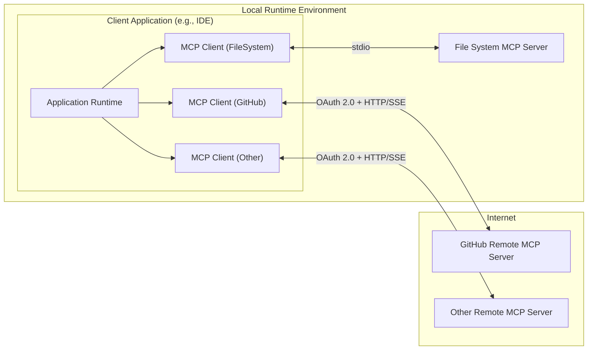
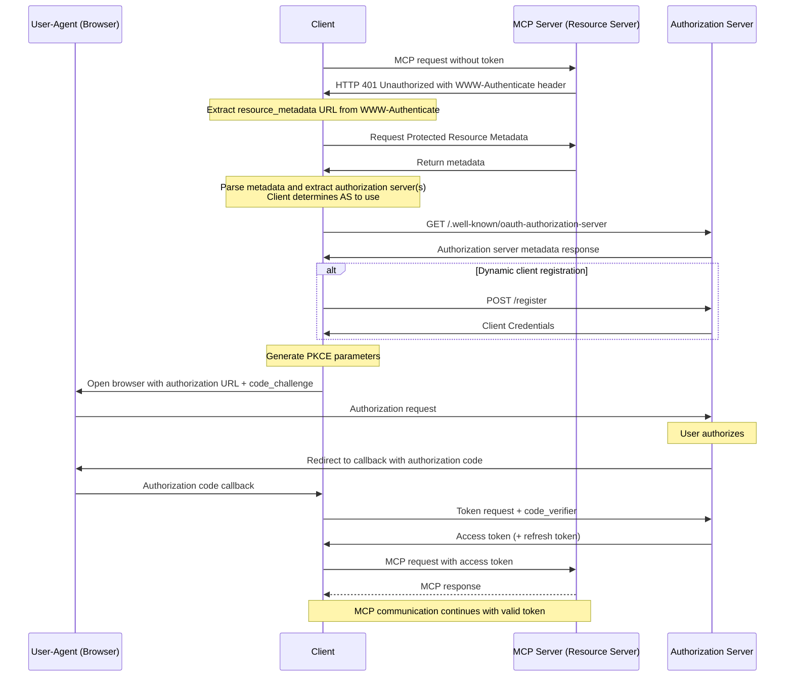

# GitHub Remote MCP Integration Guide for MCP Host Authors

This guide outlines high-level considerations for MCP Host authors who want to allow installation of the Remote GitHub MCP server.

The goal is to explain the architecture at a high-level, define key requirements, and provide guidance to get you started, while pointing to official documentation for deeper implementation details.

---

## Table of Contents

- [Understanding MCP Architecture](#understanding-mcp-architecture)
- [Connecting to the Remote GitHub MCP Server](#connecting-to-the-remote-github-mcp-server)
  - [Authentication and Authorization](#authentication-and-authorization)
  - [OAuth Support on GitHub](#oauth-support-on-github)
  - [Create an OAuth-enabled App Using the GitHub UI](#create-an-oauth-enabled-app-using-the-github-ui)
  - [Things to Consider](#things-to-consider)
  - [Initiating the OAuth Flow from your Client Application](#initiating-the-oauth-flow-from-your-client-application)
- [Handling Organization Access Restrictions](#handling-organization-access-restrictions)
- [Essential Security Considerations](#essential-security-considerations)
- [Additional Resources](#additional-resources)

---

## Understanding MCP Architecture

The Model Context Protocol (MCP) enables seamless communication between your application and various external tools through an architecture defined by the [MCP Standard](https://modelcontextprotocol.io/).

### High-level Architecture

The diagram below illustrates how a single client application can connect to multiple MCP Servers, each providing access to a unique set of resources.  Notice that some MCP Servers are running locally (side-by-side with the client application) while others are hosted remotely.  GitHub's MCP offerings are available to run either locally or remotely.

### Runtime Environment

- **Application**: The user-facing application you are building. It instantiates one or more MCP clients and orchestrates tool calls.
- **MCP Client**: A component within your client application that maintains a 1:1 connection with a single MCP server.
- **MCP Server**: A service that provides access to a specific set of tools.
  - **Local MCP Server**: An MCP Server running locally, side-by-side with the Application.
  - **Remote MCP Server**: An MCP Server running remotely, accessed via the internet.  Most Remote MCP Servers require authentication via OAuth.

For more detail, see the [official MCP specification](https://modelcontextprotocol.io/specification/draft).

> [!NOTE]
> GitHub offers both a Local MCP Server and a Remote MCP Server.

---

## Connecting to the Remote GitHub MCP Server

### Authentication and Authorization

GitHub MCP Servers require a valid access token in the `Authorization` header.  This is true for both the Local GitHub MCP Server and the Remote GitHub MCP Server.

For the Remote GitHub MCP Server, the recommended way to obtain a valid access token is to ensure your client application supports [OAuth 2.1](https://datatracker.ietf.org/doc/html/draft-ietf-oauth-v2-1-13).  It should be noted, however, that you may also supply any valid access token. For example, you may supply a pre-generated Personal Access Token (PAT).

> [!IMPORTANT]
> The Remote GitHub MCP Server itself does not provide Authentication services.
> Your client application must obtain valid GitHub access tokens through one of the supported methods.

The expected flow for obtaining a valid access token via OAuth is depicted in the [MCP Specification](https://modelcontextprotocol.io/specification/draft/basic/authorization#authorization-flow-steps).  For convenience, we've embedded a copy of the authorization flow below.  Please study it carefully as the remainder of this document is written with this flow in mind.

> [!NOTE]
> Dynamic Client Registration is NOT supported by Remote GitHub MCP Server at this time.

#### OAuth Support on GitHub

GitHub offers two solutions for obtaining access tokens via OAuth:  [**GitHub Apps**](https://docs.github.com/en/apps/using-github-apps/about-using-github-apps#about-github-apps) and [**OAuth Apps**](https://docs.github.com/en/apps/oauth-apps).  These solutions are typically created, administered, and maintained by GitHub Organization administrators.  Collaborate with a GitHub Organization administrator to configure either a **GitHub App** or an **OAuth App** to allow your client application to utilize GitHub OAuth support.  Furthermore, be aware that it may be necessary for users of your client application to register your **GitHub App** or **OAuth App** within their own GitHub Organization in order to generate authorization tokens capable of accessing Organization's GitHub resources.

> [!TIP]
> Before proceeding, check whether your organization already supports one of these solutions.  Administrators of your GitHub Organization can help you determine what **GitHub Apps** or **OAuth Apps** are already registered.  If there's an existing **GitHub App** or **OAuth App** that fits your use case, consider reusing it for Remote MCP Authorization.  That said, be sure to take heed of the following warning.

> [!WARNING]
> Both **GitHub Apps** and **OAuth Apps** require the client application to pass a "client secret" in order to initiate the OAuth flow.  If your client application is designed to run in an uncontrolled environment (i.e. customer-provided hardware), end users will be able to discover your "client secret" and potentially exploit it for other purposes.  In such cases, our recommendation is to register a new **GitHub App** (or **OAuth App**) exclusively dedicated to servicing OAuth requests from your client application.

#### Create an OAuth-enabled App Using the GitHub UI

Detailed instructions for creating a **GitHub App** can be found at ["Creating GitHub Apps"](https://docs.github.com/en/apps/creating-github-apps/about-creating-github-apps/about-creating-github-apps#building-a-github-app). (RECOMMENDED) 
Detailed instructions for creating an **OAuth App** can be found ["Creating an OAuth App"](https://docs.github.com/en/apps/oauth-apps/building-oauth-apps/creating-an-oauth-app).

For guidance on which type of app to choose, see ["Differences Between GitHub Apps and OAuth Apps"](https://docs.github.com/en/apps/oauth-apps/building-oauth-apps/differences-between-github-apps-and-oauth-apps).

#### Things to Consider:
- Tokens provided by **GitHub Apps** are generally more secure because they:
  - include an expiration
  - include support for fine-grained permissions
- **GitHub Apps** must be installed on a GitHub Organization before they can be used. In general, installation must be approved by someone in the Organization with administrator permissions.  For more details, see [this explanation](https://docs.github.com/en/apps/oauth-apps/building-oauth-apps/differences-between-github-apps-and-oauth-apps#who-can-install-github-apps-and-authorize-oauth-apps). By contrast, **OAuth Apps** don't require installation and, typically, can be used immediately.
- Members of an Organization may use the GitHub UI to [request that a GitHub App be installed](https://docs.github.com/en/apps/using-github-apps/requesting-a-github-app-from-your-organization-owner) organization-wide.
- While not strictly necessary, if you expect that a wide range of users will use your MCP Server, consider publishing its corresponding **GitHub App** or **OAuth App** on the [GitHub App Marketplace](https://github.com/marketplace?type=apps) to ensure that it's discoverable by your audience.

#### Initiating the OAuth Flow from your Client Application

For **GitHub Apps**, details on initiating the OAuth flow from a client application are described in detail [here](https://docs.github.com/en/apps/creating-github-apps/authenticating-with-a-github-app/generating-a-user-access-token-for-a-github-app#using-the-web-application-flow-to-generate-a-user-access-token).

For **OAuth Apps**, details on initiating the OAuth flow from a client application are described in detail [here](https://docs.github.com/en/apps/oauth-apps/building-oauth-apps/authorizing-oauth-apps#web-application-flow).

> [!IMPORTANT]
> For endpoint discovery, be sure to honor the [`WWW-Authenticate` information provided](https://modelcontextprotocol.io/specification/draft/basic/authorization#authorization-server-location) by the Remote GitHub MCP Server rather than relying on hard-coded endpoints like `https://github.com/login/oauth/authorize`.

### Handling Organization Access Restrictions
Organizations may block **GitHub Apps** and **OAuth Apps** until explicitly approved. Within your client application code, you can provide actionable next steps for a smooth user experience in the event that OAuth-related calls fail due to your **GitHub App** or **OAuth App** being unavailable (i.e. not registered within the user's organization).

1. Detect the specific error.
2. Notify the user clearly.
3. Depending on their GitHub organization privileges:
    - Org Members: Prompt them to request approval from a GitHub organization admin, within the organization where access has not been approved.
    - Org Admins: Link them to the corresponding GitHub organization’s App approval settings at `https://github.com/organizations/[ORG_NAME]/settings/oauth_application_policy`

## Essential Security Considerations
- **Token Storage**: Use secure platform APIs (e.g. keytar for Node.js).
- **Input Validation**: Sanitize all tool arguments.
- **HTTPS Only**: Never send requests over plaintext HTTP. Always use HTTPS in production.
- **PKCE:** We strongly recommend implementing [PKCE](https://datatracker.ietf.org/doc/html/rfc7636) for all OAuth flows to prevent code interception, to prepare for upcoming PKCE support.

## Additional Resources
- [MCP Official Spec](https://modelcontextprotocol.io/specification/draft)
- [MCP SDKs](https://modelcontextprotocol.io/sdk/java/mcp-overview)
- [GitHub Docs on Creating GitHub Apps](https://docs.github.com/en/apps/creating-github-apps)
- [GitHub Docs on Using GitHub Apps](https://docs.github.com/en/apps/using-github-apps/about-using-github-apps)
- [GitHub Docs on Creating OAuth Apps](https://docs.github.com/en/apps/oauth-apps)
- GitHub Docs on Installing OAuth Apps into a [Personal Account](https://docs.github.com/en/apps/oauth-apps/using-oauth-apps/installing-an-oauth-app-in-your-personal-account) and [Organization](https://docs.github.com/en/apps/oauth-apps/using-oauth-apps/installing-an-oauth-app-in-your-organization)
- [Managing OAuth Apps at the Organization Level](https://docs.github.com/en/organizations/managing-oauth-access-to-your-organizations-data)
- [Managing Programmatic Access at the GitHub Organization Level](https://docs.github.com/en/organizations/managing-programmatic-access-to-your-organization)
- [Building Copilot Extensions](https://docs.github.com/en/copilot/building-copilot-extensions)
- [Managing App/Extension Visibility](https://docs.github.com/en/copilot/building-copilot-extensions/managing-the-availability-of-your-copilot-extension) (including GitHub Marketplace information)
- [Example Implementation in VS Code Repository](https://github.com/microsoft/vscode/blob/main/src/vs/workbench/api/common/extHostMcp.ts#L313)
